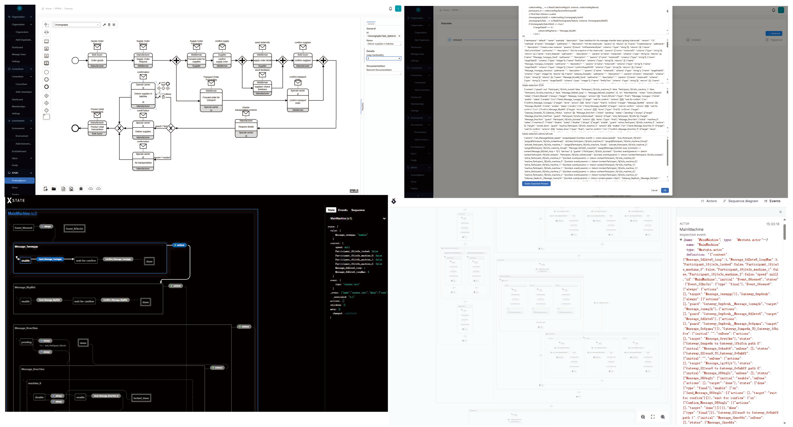

# Multi-BlockCollab: A Statechart-Based Approach for Cross-Platform Adaptive Blockchain Execution of Collaborative Business Processes with Multiple Instances



## Main Features

 1) **A standardized business collaboration modeling method** that integrates DMN with the BPMN choreography model for modeling business processes and  decisions in multi-organizational collaborations.
 2)  **A SC Translator** translates integrated BPMN-DMN business models into Hyperledger Fabric SC code, enabling the execution of multi-instance collaborative business processes and decision execution. At the same time, managing collaborative identities based on blockchain Attribute-Based Access Control (ABAC).
 3)  **An innovative hybrid on-chain and off-chain execution environment** based on IBC is proposed. The hybrid environment provides: (1) a collaboration model to ensure participants clearly understand their roles and map physical resources to optimize the construction of the environment; (2) a blockchain-based on-chain and off-chain environment using Hyperledger Fabric and InterPlanetary File System (IPFS); (3) a connector that links on-chain and off-chain systems, supporting smooth integration with external systems; (4) Integration with an Oracle, bridging the gap between reality and blockchain.

## New Features

1) **Support for Multi-Task and Multi-Participant Scenarios**: Enables more comprehensive multi-party collaboration by allowing multiple tasks and participants to interact seamlessly within the business process, enhancing flexibility and scalability in complex workflows.  
2) **Introduction of StateCharts**: Separates state flow control from ledger data read/write operations, effectively preventing state explosion and improving the efficiency and maintainability of the system.


## Project Structure 

```
┌───────────┐  ┌───────────────┐
│ Experiment├──┤ CaseTest      │  - case to test the correctness and completeness of the system
└───────────┘  │               │    * Real Case
               │               │    * Corner Case
               └────┬──────────┘
               ┌────┴──────────┐  - data of performance test
               │ Performance   │    * data of physical resources construction time
               │ FileAndResult |    * data of chaincode execution time
               └────┬──────────┘    * data of chaincode generation time
               ┌────┴──────────┐  - Comformance Test Related
               │NoiseExperiment│    * cases of extended-BPMN
               │               |    * path extracted from cases
               └───────────────┘    * comformance experiment result


┌──────────┐  ┌───────────────┐  - connector to the Docker Engine
│ src      ├──┤ agent         │    * create and manage Docker containers
└──────────┘  │               │    
              │               │  
              └─────┬─────────┘    
                    │
              ┌─────┴─────────┐  - main component to handle multi-party collaboration
              │ backend       │    * platform register and login
              │               |    * environment management
              └─────┬─────────┘    
                    │
              ┌─────┴─────────┐  - mirco-service to translate BPMN to chaincode
              │ chaincode     │    
              │ translator    │        
              └─────┬─────────┘
                    │
              ┌─────┴─────────┐  - modeling tool to create BPMN choreography model
              │ chor_js       │
              │               │        
              └─────┬─────────┘
                    │   
              ┌─────┴─────────┐  - front-end to interact with users
              │ front         │
              │               │        
              └───────────────┘  
              
```

## Deploy Guide

### Prerequisites

This project is based on Docker containers, which requires a Linux system/WSL2 environment, as well as Docker and Docker Compose.

### Requirements
#### docker pull images
  pull docker images : 
  1. `docker pull yeasy/hyperledger-fabric-peer:2.2.0` 
  2. `docker pull hyperledger/fabric-ca:latest`
  
#### create docker net work
      `docker network create cello-net`

#### give the permission to the /etc/hosts
      `sudo chmod 777 /etc/hosts`
      
#### GCC and Make

 `sudo apt-get install build-essential`

#### Python3

`sudo apt-get install python3-dev`

#### libgraphviz-dev

``` shell
apt-get update && apt-get install -y gettext-base graphviz libgraphviz-dev && apt-get autoclean && apt-get clean && apt-get autoremove && rm -rf /var/cache/apt/
```

### Database Configuration

Using docker compose to start the database service.

``` shell
docker-compose -f docker-compose.yml up -d
```

### backend Configuration

#### Dependency

``` shell
pip install -r requirements.txt
```

recommended to use python-venv.

#### Setting up the database

``` shell
python3 manage.py makemigrations
python3 manage.py migrate
```

------

### agent Configuration

#### Dependency

``` shell
pip install -r requirements.txt
```

Recommended to use python-venv.

#### Start the agent

``` shell
gunicorn server:app -c ./gunicorn.conf.py
```


