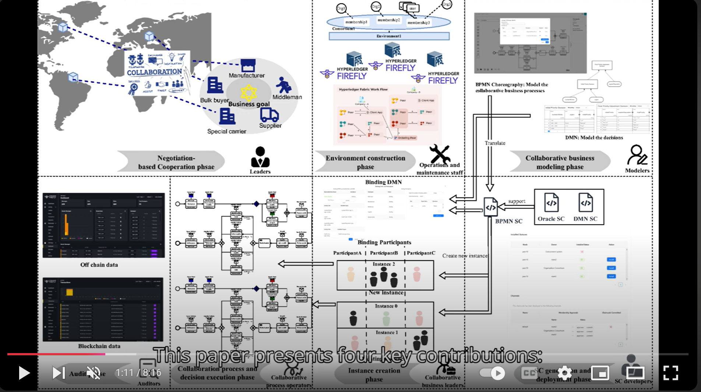

# BlockCollab: A Hybrid BPMN-DMN Framework for Blockchain-Based Inter-organizational Processes and Decisions Collaboration


## Vedio 
[](https://www.youtube.com/watch?v=Ir1F8Y6AhdE)

## Main Features
 1) **A standardized business collaboration modeling method** that integrates DMN with the BPMN choreography model for modeling business processes and  decisions in multi-organizational collaborations.
 2)  **A SC Translator** translates integrated BPMN-DMN business models into Hyperledger Fabric SC code, enabling the execution of multi-instance collaborative business processes and decision execution. At the same time, managing collaborative identities based on blockchain Attribute-Based Access Control (ABAC).
 3)  **An innovative hybrid on-chain and off-chain execution environment** based on IBC is proposed. The hybrid environment provides: a) a collaboration model to ensure participants clearly understand their roles and map physical resources to optimize the construction of the environment; b) a blockchain-based on-chain and off-chain environment using Hyperledger Fabric and InterPlanetary File System (IPFS); c) a connector that links on-chain and off-chain systems, supporting smooth integration with external systems; d) Integration with an Oracle, bridging the gap between reality and blockchain.

## Project Structure 


```
┌───────────┐  ┌───────────────┐
│ Experiment├──┤ CaseTest      │  - case to test the correctness and completeness of the system
└───────────┘  │               │    * Real Case
               │               │    * Corner Case
               └────┬──────────┘
               ┌────┴──────────┐  - data of performance test
               │ Performance   │    * data of physical resources construction time
               │ Test          |    * data of chaincode execution time
               └────┬──────────┘    * data of chaincode generation time
                    |
               ┌────┴──────────┐  - Comformance Test Related
               │NoiseExperiment│    * cases of extended-BPMN
               │               |    * path extracted from cases
               └───────────────┘    * comformance experiment result
                    


┌──────────┐  ┌───────────────┐  - connector to the Docker Engine
│ src      ├──┤ agent         │    * create and manage Docker containers
└──────────┘  │               │    
              │               │  
              └─────┬─────────┘    
                    │
              ┌─────┴─────────┐  - main component to handle multi-party collaboration
              │ backend       │    * platform register and login
              │               |    * environment management
              └─────┬─────────┘    
                    │
              ┌─────┴─────────┐  - mirco-service to translate BPMN into chaincode
              │ py_translator │    
              │               │        
              └─────┬─────────┘
                    │
              ┌─────┴─────────┐  - Vscode plugin that manage sinppets for chaincode generation 
              │ jsoncodeeditor│  
              │               │        
              └─────┬─────────┘
                    │   
              ┌─────┴─────────┐  - front-end to interact with users
              │ front         │
              │               │        
              └───────────────┘  
              
```
# Detailed Tutorial

### 1. install wsl/Ubuntu

Ubuntu-20.04


### 2. install docker

##### by script

```
 curl -fsSL https://test.docker.com -o test-docker.sh
 sudo sh test-docker.sh
 sudo apt install docker-compose
```


### 3. other essential

##### GCC and other

 `sudo apt-get install build-essential`

##### python3.10+

sudo apt update

(sudo apt install software-properties-common)

(sudo add-apt-repository ppa:deadsnakes/ppa)

sudo apt install python3.10

sudo apt-get install python3.10-venv

（sudo apt install libpython3.10-dev）

（pip install setuptools==68.0.0）

sudo apt-get install python3-dev

##### libgraphviz

`apt-get update \`
`&& apt-get install -y gettext-base graphviz libgraphviz-dev \`
`&& apt-get autoclean \`
`&& apt-get clean \`
`&& apt-get autoremove && rm -rf /var/cache/apt/`

##### Go

###### 1. intsall

wget https://golang.google.cn/dl/go1.21.12.linux-amd64.tar.gz

sudo tar -C /usr/local -zxvf go1.21.12.linux-amd64.tar.gz

###### 2. go environment

export GOROOT=/usr/local/go

export PATH=$PATH:$GOROOT/bin 

source

###### 3. go dependency

Set go proxy: https://goproxy.cn

go env -w GOPROXY=https://goproxy.cn,direct

 export http_proxy=172.26.224.1:7890

 export https_proxy=172.26.224.1:7890

cd /IBC/src/backend/opt/chaincode-go-bpmn

go mod tidy

###### 4. go download firefly

go install github.com/hyperledger/firefly-cli/ff@latest

firefly environment


##### docker image

docker pull yeasy/hyperledger-fabric-peer:2.2.0

docker pull hyperledger/fabric-ca:latest 

(docker pull hyperledger/fabric-ca:1.5.7)

(docker tag <id> hyperledger/fabric-ca:latest)


##### other 

sudo chmod 777 /etc/hosts


##### cello相关

docker network create cello-net


 export http_proxy=172.26.224.1:7890

 export https_proxy=172.26.224.1:7890

ff start cello_env --verbose 


##### clone ChainCollab

git clone https://github.com/XinzheShen182/ChainCollab

git switch ChainCollab


### Backend + oracle

`python -m venv venv_name`

`source venv_name/bin/activate`

`pip install -r requirements.txt`


### front

sudo apt install npm

sudo apt install nodejs

npm install


### agent

`python -m venv venv_name`

`source venv_name/bin/activate`

`pip install -r requirements.txt`


### translator

Similar to above


### 运行

1. source startrc

2. Enter the following commands in 5 terminals respectively:

（1）start_front

（2）start_agent

（3）start_backend

（4）start_translator

 (5) start_oracle


